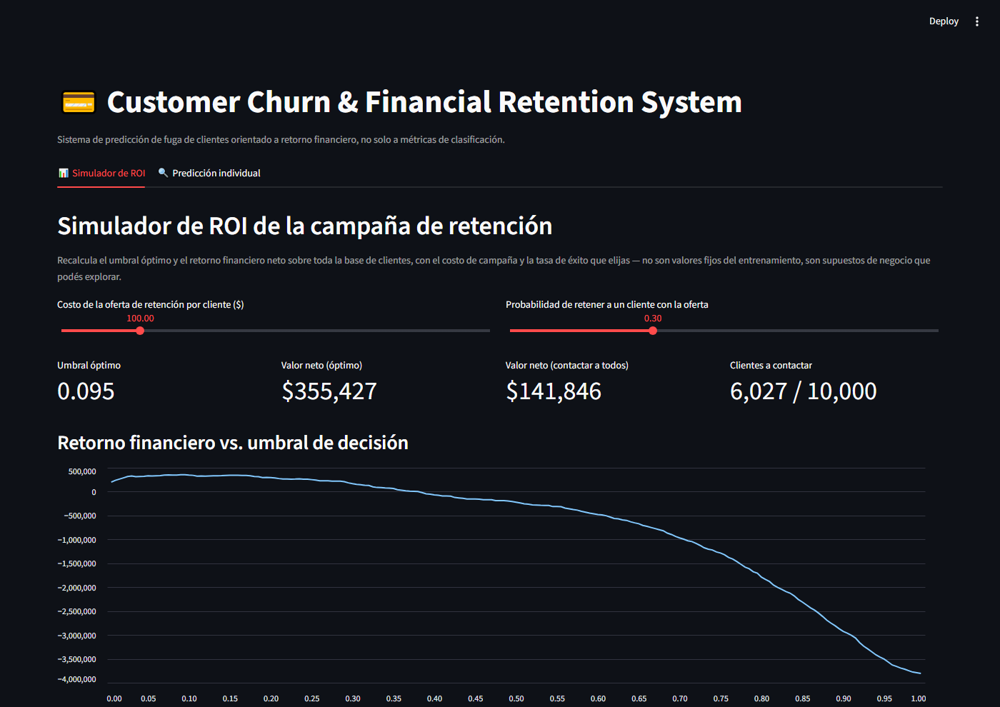
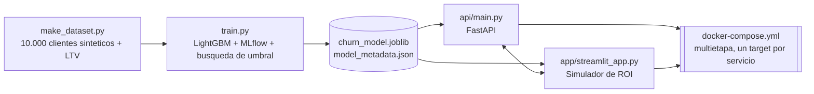
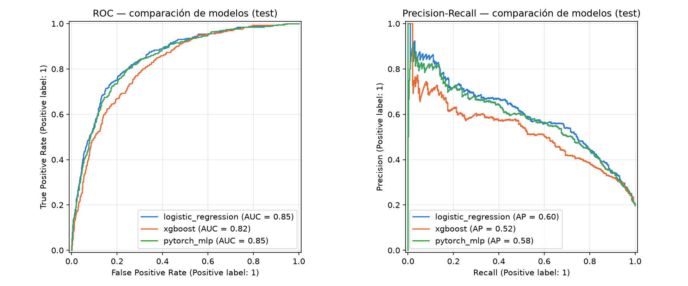
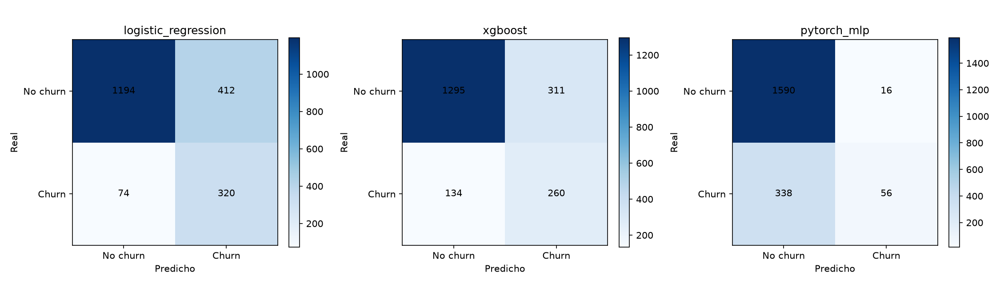
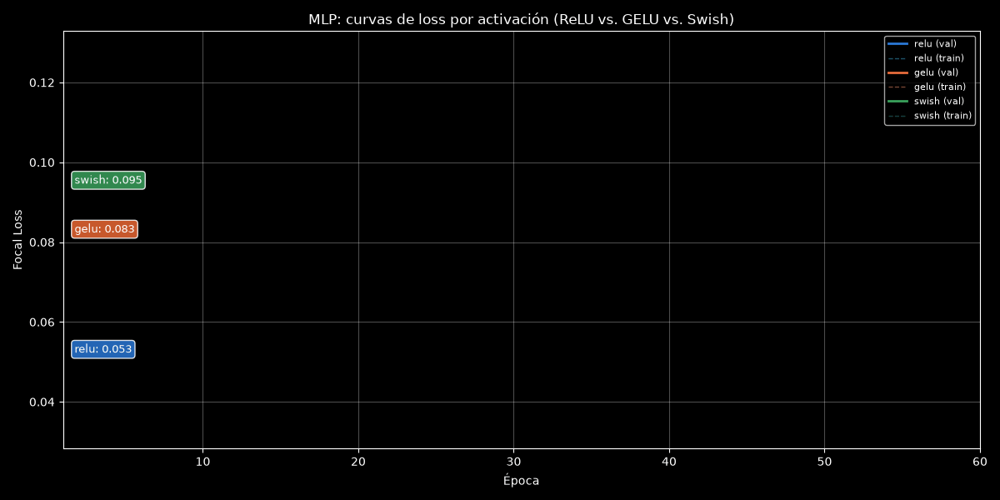
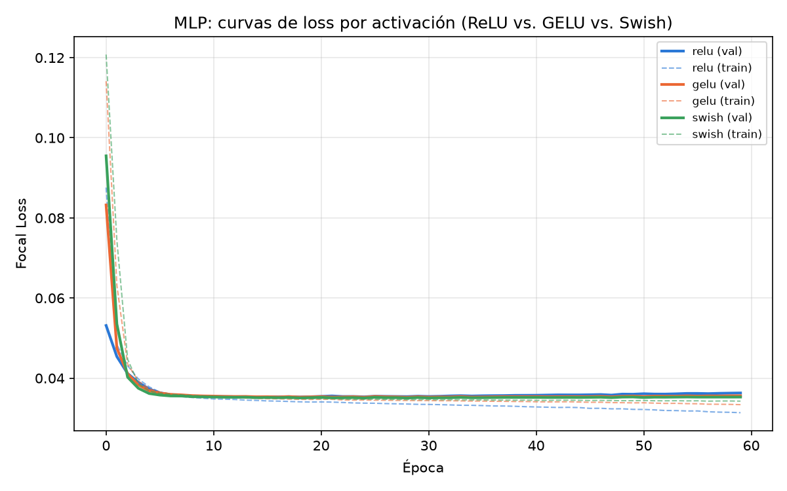
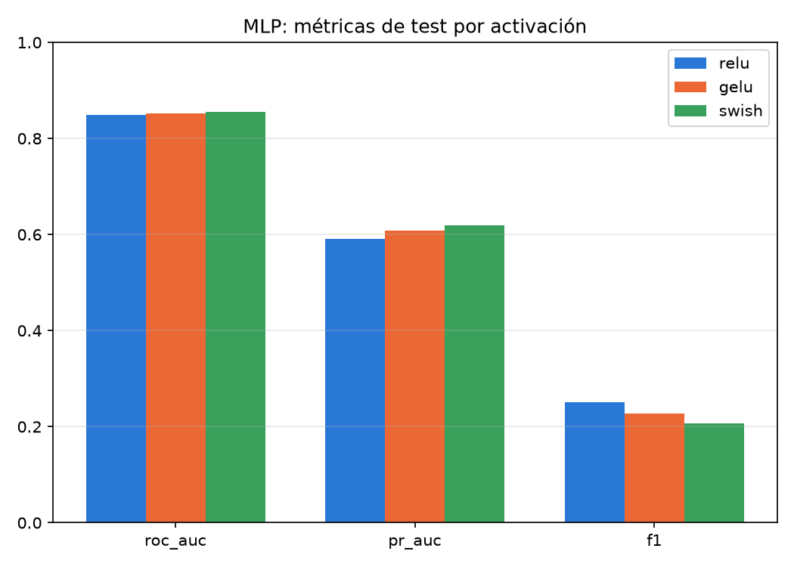

[ 🇨🇱 Español ] | [ 🇺🇸 Read in English ](README.md)

# Plataforma MLOps de Predicción y Retención de Churn de Clientes




Sistema end-to-end de predicción de fuga de clientes para banca/retail, diseñado alrededor de una idea central: **un modelo de churn no vale por su AUC, vale por cuánto dinero deja de perder la empresa cuando se usa para decidir a quién contactar.**

## Impacto de Negocio e Indicadores Clave (KPIs)

Evaluado en un holdout de test nunca visto durante entrenamiento ni optimización de umbral:

| Estrategia | Valor financiero neto | Clientes contactados |
|---|---:|---:|
| No contactar a nadie | −$809,055 | 0% |
| Contactar a todos (sin modelo) | +$42,717 | 100% |
| **Umbral óptimo del modelo** | **+$75,847** | 78.6% |

El modelo casi duplica el retorno de una campaña indiscriminada, contactando a menos gente. Ese es el producto: no "quién va a fugarse", sino "a quién conviene ofrecerle algo, y cuánto vale hacerlo".

**El umbral no es un artefacto de un split favorable**: `notebooks/02_LTV_Cost_Sensitive_Thresholding.ipynb` lo verifica directamente — recalculado desde cero sobre la distribución real de LTV del propio holdout (un ejercicio puramente diagnóstico, nunca usado como decisión operativa), el óptimo cae exactamente en el mismo punto (umbral = 0.03) que el elegido en validación. Ver [Fase 4](#fase-4--análisis-de-umbral-ponderado-por-ltv-en-holdout) para el detalle completo.

## Arquitectura



```
┌────────────────────────┐
│  make_dataset.py        │  10,000 clientes sintéticos + LTV proyectado
└────────────┬─────────────┘
             │
             ▼
┌────────────────────────┐
│       train.py           │  LightGBM + split 50/30/20 + MLflow (tracking +
│  (MLflow: SQLite local)  │  registry) + búsqueda de umbral por retorno ($)
└────────────┬─────────────┘
             │
    ┌────────┴─────────┐
    │  data/processed/   │  churn_model.joblib + model_metadata.json
    └────────┬─────────┘
             │
   ┌─────────┴──────────┐
   ▼                     ▼
┌─────────────┐   ┌──────────────────┐
│  api/main.py │◄──┤ app/streamlit_app │  Simulador de ROI (recalcula el umbral
│  (FastAPI)   │   │  .py              │  en vivo) + predicción individual (vía API)
└─────────────┘   └──────────────────┘
       │                    │
       └─────────┬──────────┘
                  ▼
        docker-compose.yml
   (Dockerfile multietapa, un target por servicio)
```

`notebooks/02_LTV_Cost_Sensitive_Thresholding.ipynb` corre en paralelo a este pipeline, consumiendo directamente el modelo entrenado y `src/models/train.py` para profundizar en la distribución de LTV del holdout y la curva de ganancia (§Fase 4).

## El proceso (las 4 fases)

Este proyecto se construyó en fases, entregadas y verificadas una por una — no se escribió todo de una vez y se asumió que funcionaba.

### Fase 1 — Datos y modelado

`src/data/make_dataset.py` genera 10,000 clientes bancarios sintéticos con un modelo de riesgo de fuga logístico (antigüedad, satisfacción, quejas, actividad, número de productos) y un **LTV proyectado** (ingreso mensual actual × meses de vida útil futura esperados, según actividad).

`src/models/train.py` entrena LightGBM sobre un split 50/30/20 (train / val / test), trackea todo en MLflow (SQLite local, con Model Registry funcionando), y — el corazón del proyecto — busca el **umbral de decisión que maximiza el retorno financiero neto** en validación, no el que maximiza F1 o accuracy.

**Esto no salió bien a la primera.** La primera versión del umbral óptimo era degenerado: 0.01, básicamente "contactar a todo el mundo". La razón, una vez diagnosticada: con la asimetría de costos de este problema (no contactar a un churner real cuesta su LTV completo; contactar a alguien que no lo era cuesta solo el precio de la campaña), el punto de indiferencia matemático es `costo / (LTV × (1 + tasa_de_éxito))` — y con un costo de campaña trivial frente al LTV en juego, ese punto cae por debajo de casi cualquier probabilidad predicha, así que "contactar a todos" gana matemáticamente sin que el modelo aporte nada. Ajustar solo el costo tampoco alcanzaba: subirlo demasiado volvía negativo el valor en *cualquier* umbral. La solución fue dos cambios combinados: un costo de campaña realista ($100, una oferta real — descuento de comisiones, bono — no una llamada trivial) y un modelo de riesgo con menos ruido (ROC-AUC 0.75 → 0.82), hasta que el óptimo cayó en una zona genuinamente interior y rentable. El detalle completo está comentado en `src/models/train.py`.

### Fase 2 — API y UI

`src/api/main.py`: FastAPI + Pydantic v2, con `lifespan` (no el `on_event` deprecado) para cargar el modelo al arrancar. Antes de escribirla verifiqué empíricamente un detalle no obvio de LightGBM en producción: hace falta castear las columnas categóricas a `dtype="category"` en cada request (si no, falla con `"train and valid dataset categorical_feature do not match"`), pero **no** hace falta replicar los niveles exactos de categorías vistos en entrenamiento — el booster guarda su propio mapeo interno (`pandas_categorical`) y lo aplica solo. Endpoints: `/health`, `/model/info`, `/predict`, `/predict/batch`.

`src/app/streamlit_app.py`: dos pestañas. **Simulador de ROI**, con sliders para costo de campaña y tasa de éxito que recalculan el umbral óptimo y el retorno en vivo sobre los 10,000 clientes. **Predicción individual**, que llama a la API real (no carga el modelo por su cuenta) — arquitectura de microservicios genuina.

### Fase 3 — Contenedorización y tests

`Dockerfile` multietapa: `builder` (compila con `build-essential`/`cmake`) → `runtime` (base mínima compartida, con `libgomp1` instalado — sin esa librería, LightGBM falla al importar en Debian slim con `libgomp.so.1: cannot open shared object file`, un gotcha real que vale la pena dejar documentado) → `api` y `app` como targets finales del mismo Dockerfile, para no duplicar la definición de dependencias. `docker-compose.yml` levanta ambos servicios, monta `data/` como volumen de solo lectura (los artefactos del modelo no se hornean en la imagen), y usa un healthcheck sin `curl` (vía `urllib` de la stdlib) para que `app` espere a que `api` esté realmente lista.

`tests/`: suite de integración con `pytest`. `conftest.py` genera el dataset y entrena el modelo automáticamente si no existen — verificado de verdad borrando todos los artefactos y corriendo `pytest tests/` desde cero (16/16 tests verdes), no solo asumido.

**Verificación de Docker sin un daemon disponible.** Este entorno de ejecución no tiene Docker instalado (ni Docker Desktop ni el CLI), así que `docker compose up --build` en sí no se pudo correr literalmente. En vez de dejarlo en "revisalo antes de un despliegue real" sin más, se validó todo lo que sí se puede validar sin el daemon, replicando cada etapa del Dockerfile por fuera del contenedor:

1. **Instalación limpia de `requirements.txt` en un venv aislado** — replica exactamente lo que hace la etapa `builder`; sin conflictos de dependencias.
2. **Los comandos `CMD` exactos del Dockerfile, corridos tal cual** — `uvicorn src.api.main:app --host 0.0.0.0 --port 8000` y `streamlit run src/app/streamlit_app.py --server.address=0.0.0.0 --server.port=8501 --server.headless=true` arrancan y sirven correctamente en ese venv aislado.
3. **El comando exacto del `healthcheck`** de `docker-compose.yml` (`python -c "import urllib.request; urllib.request.urlopen(...)"`) ejecutado contra la API corriendo — responde `{"status":"ok","model_loaded":true}`.
4. **Pipeline completo de punta a punta** (`make_dataset.py` → `train.py` → servir con el `CMD` real) corrido en el venv aislado, sin artefactos heredados de otra instalación.
5. **Los 16 tests de integración**, corridos desde cero contra el modelo recién entrenado.

Esto no reemplaza un `docker compose up --build` real — las rutas de `COPY`, el orden de las etapas multietapa y el propio motor de Docker siguen sin ejecutarse literalmente — pero cubre exactamente el código y los comandos que terminan corriendo dentro del contenedor, con una confianza mucho más alta que "está escrito con cuidado". **Recomendación**: antes de un despliegue real, correr `docker compose up --build` una vez en una máquina con Docker instalado como último paso de verificación.

### Fase 4 — Análisis de umbral ponderado por LTV en holdout

`notebooks/02_LTV_Cost_Sensitive_Thresholding.ipynb` (ejecutado de punta a punta, cero errores) profundiza en tres preguntas que `train.py` no muestra en detalle:

1. **¿Cómo se distribuye el LTV en el holdout?** El churner real promedio vale $2,053, con una cola pesada (desviación estándar ~$1,730 del mismo orden que la media) — consistente con por qué el umbral se elige en un set de validación grande (30%) antes de tocar el holdout.
2. **¿El umbral óptimo es un artefacto del split, o generaliza?** Recalculado directamente sobre la distribución de LTV del holdout (puramente diagnóstico — la decisión operativa real sigue siendo la de validación), el óptimo cae **exactamente en el mismo umbral (0.03)** que el elegido en validación, con diferencia de valor financiero de $0.00. Evidencia directa de que el umbral no está sobreajustado a un split particular.
3. **Curva de ganancia: costo de retención vs. LTV salvado.** Ordenando el holdout de mayor a menor riesgo predicho, el modelo recupera sustancialmente más LTV por el mismo costo de campaña que un orden aleatorio (el lift real, no solo un AUC en abstracto). El óptimo exacto del objetivo financiero completo (barrido cliente a cliente, incluyendo el costo de no actuar sobre un churner real) cae a 12 clientes de distancia del umbral operativo elegido por el grid search de 0.01 de `train.py` — la granularidad de esa búsqueda no deja valor relevante sobre la mesa.

### Fase 5 — Comparación de modelos: regresión logística vs. XGBoost vs. PyTorch MLP

Antes de asentar LightGBM como el modelo realmente servido en producción (Fases 1–4), `src/models/compare_models.py` responde la pregunta de model selection que una plataforma MLOps madura debería poder mostrar con evidencia: **¿cómo se compara contra un baseline más simple y contra deep learning, en exactamente el mismo split 50/30/20 y las mismas features?** Este script es puramente aditivo — no toca `train.py`, la API ni la app de Streamlit; existe para documentar la comparación, no para reemplazar lo que ya está en producción.

Tres enfoques complementarios:

| Enfoque | Librería | Por qué está |
|---|---|---|
| Regresión logística (`class_weight="balanced"`) | scikit-learn | Baseline interpretable — coeficientes auditables, piso mínimo de calidad |
| Árboles con gradient boosting | XGBoost | Un segundo ensamble de árboles (librería distinta a la servida en producción) para verificar que el resultado no es un artefacto específico de LightGBM |
| MLP con Focal Loss custom | PyTorch | Deep learning con una loss diseñada para el desbalance de clases del churn (~20% positivos), más una comparación controlada de activaciones ReLU vs. GELU vs. Swish sobre la misma arquitectura |

**Resultados en test** (mismo holdout de las Fases 1–4, evaluado al umbral por defecto 0.5 — esta es una comparación de model selection, no el umbral financiero operativo de `train.py`):

| Modelo | ROC-AUC | PR-AUC | F1 |
|---|---:|---:|---:|
| Regresión logística | 0.852 | 0.601 | 0.568 |
| XGBoost | 0.820 | 0.523 | 0.539 |
| PyTorch MLP (mejor activación, Focal Loss) | 0.845 | 0.580 | 0.240 |

Las tres familias caen en un rango de ROC-AUC similar sobre este dataset sintético — ningún enfoque domina claramente, lo cual es evidencia útil en sí misma: significa que la ventaja de LightGBM en las Fases 1–4 (ROC-AUC 0.82, ajustado para el objetivo *financiero* y no para F1) no está dejando valor sobre la mesa frente a una clase de algoritmo fundamentalmente mejor. El F1 del MLP es más bajo al corte 0.5 sin ajustar porque la Focal Loss recalibra las probabilidades alrededor de los ejemplos difíciles — consistente con el propio hallazgo de `train.py` de que un corte 0.5 ingenuo es el lente equivocado para este problema desde el principio.

**Comparación de activaciones** (MLP, set de validación, misma arquitectura y Focal Loss, solo cambia la no-linealidad):

| Activación | ROC-AUC | PR-AUC | F1 |
|---|---:|---:|---:|
| ReLU | 0.849 | 0.591 | 0.251 |
| GELU | 0.853 | 0.609 | 0.227 |
| **Swish** | **0.855** | **0.619** | 0.206 |

Swish tuvo el mejor PR-AUC de validación y fue la activación seleccionada para la fila de test del MLP arriba. En este dataset tabular de baja dimensionalidad, la elección de activación mueve el PR-AUC por un margen chico — Swish le gana a ReLU/GELU, pero la brecha no se acerca a explicar la diferencia entre familias de *modelos*. Medido, no asumido.



La versión animada de abajo dibuja la curva real de loss de cada activación cuadro a cuadro, con una etiqueta flotante que sigue su valor actual.





Las métricas de las 3 familias de modelos y las 3 activaciones se persisten en `reports/model_comparison.duckdb` (tablas `model_comparison_metrics` y `mlp_activation_comparison`) — un complemento liviano, consultable con SQL, al tracking/registry de MLflow que `train.py` ya usa para el modelo de producción.

```bash
python -m src.models.compare_models
```

## Estructura del proyecto

```
customer-churn-mlops-platform/
├── data/
│   ├── raw/                        # customers.csv (generado, no versionado)
│   └── processed/                  # churn_model.joblib, model_metadata.json,
│                                    #   figures/threshold_vs_value.png (generados)
├── src/
│   ├── data/
│   │   └── make_dataset.py         # Genera 10,000 clientes sintéticos + LTV
│   ├── models/
│   │   ├── train.py                # LightGBM + MLflow + umbral por retorno financiero
│   │   └── compare_models.py       # Comparación LR / XGBoost / PyTorch MLP (Fase 5)
│   ├── api/
│   │   └── main.py                 # FastAPI: /predict, /predict/batch, /model/info
│   └── app/
│       └── streamlit_app.py        # Simulador de ROI + predicción individual
├── notebooks/
│   └── 02_LTV_Cost_Sensitive_Thresholding.ipynb  # LTV en holdout + curva de ganancia
├── reports/
│   ├── figures/                    # roc_pr_comparison.png, confusion_matrices.png,
│   │                                #   mlp_activation_loss_curves.png, mlp_activation_comparison.png
│   └── model_comparison.duckdb     # métricas de comparación (generado, no versionado)
├── tests/
│   ├── conftest.py                 # Auto-bootstrap de dataset + modelo para CI
│   ├── test_data_and_training.py
│   ├── test_api.py
│   └── test_model_comparison.py
├── docs/
│   └── streamlit_preview.png
├── Dockerfile                      # Multietapa: builder -> runtime -> api / app
├── docker-compose.yml
├── requirements.txt
├── LICENSE
├── README.md
└── README.es.md
```

## Instalación

```bash
python -m venv .venv
source .venv/bin/activate      # En Windows: .venv\Scripts\activate
pip install -r requirements.txt
```

## Uso

```bash
# 1. Generar el dataset sintético
python -m src.data.make_dataset

# 2. Entrenar (LightGBM + MLflow + optimización de umbral financiero)
python -m src.models.train

# 3a. Levantar la API
uvicorn src.api.main:app --reload

# 3b. Levantar la UI (en otra terminal; espera que la API esté corriendo)
streamlit run src/app/streamlit_app.py

# Ver los experimentos trackeados en MLflow
mlflow ui --backend-store-uri sqlite:///mlflow.db

# Pruebas de integración (auto-genera dataset/modelo si hace falta)
pytest tests/ -v

# Opcional: comparar LR / XGBoost / PyTorch MLP contra el LightGBM de producción
python -m src.models.compare_models
```

### Notebook de análisis (opcional, no forma parte de la imagen Docker)

```bash
pip install jupyter ipykernel nbconvert
jupyter nbconvert --to notebook --execute --inplace notebooks/02_LTV_Cost_Sensitive_Thresholding.ipynb
```

Jupyter no se agrega a `requirements.txt` a propósito: ese archivo es el que instala el `Dockerfile` dentro de las imágenes de `api`/`app`, y un notebook de análisis no tiene nada que hacer dentro de un contenedor de servicio en producción.

## Despliegue con Docker

```bash
# Construye ambas imágenes (api, app) y levanta los dos servicios
docker compose up --build

# API:       http://localhost:8000/docs  (Swagger UI interactivo)
# Streamlit: http://localhost:8501
```

Qué hace `docker-compose.yml` exactamente:

- **`api`** se construye desde el target `api` del `Dockerfile` (imagen `churn-api:latest`), expone el puerto `8000`, monta `./data` como volumen de solo lectura (`:ro`) — el modelo entrenado se lee desde el host, no se hornea en la imagen — y expone un `healthcheck` que golpea `/health` cada 10s (con `start_period` de 15s) usando `urllib` de la stdlib, sin depender de que `curl` esté instalado en la imagen mínima.
- **`app`** se construye desde el target `app` (imagen `churn-streamlit:latest`), expone el puerto `8501`, también monta `./data` de solo lectura, recibe `API_URL=http://api:8000` como variable de entorno para hablarle a la API por el nombre del servicio de Docker Compose (no `localhost`), y tiene `depends_on: api: condition: service_healthy` — no arranca hasta que el healthcheck de `api` esté en verde.

Comandos útiles una vez levantado:

```bash
docker compose ps                 # estado de ambos servicios
docker compose logs -f api        # logs en vivo de la API
curl http://localhost:8000/health # {"status":"ok","model_loaded":true}
docker compose down               # apaga y elimina los contenedores (no los volúmenes montados)
```

**Requisito previo**: `data/processed/churn_model.joblib` y `model_metadata.json` deben existir en el host antes de levantar los contenedores (correr `python -m src.data.make_dataset` y `python -m src.models.train` primero) — los contenedores *sirven* el modelo entrenado, no lo entrenan; el volumen de solo lectura es deliberado, separa el ciclo de vida del artefacto de modelo del ciclo de vida del código de la aplicación.

## Referencia de la API

| Método | Ruta | Descripción |
|---|---|---|
| `GET` | `/health` | Estado del servicio y si el modelo está cargado |
| `GET` | `/model/info` | Metadata del modelo activo: umbral óptimo, AUC, supuestos de negocio |
| `POST` | `/predict` | Predicción para un cliente; si se envía `ltv`, agrega el valor financiero esperado |
| `POST` | `/predict/batch` | Predicción para una lista de clientes |

Ejemplo:

```bash
curl -X POST http://localhost:8000/predict -H "Content-Type: application/json" -d '{
  "credit_score": 550, "geography": "West", "gender": "Male", "age": 35,
  "tenure_years": 0, "balance": 500, "num_products": 1, "has_credit_card": false,
  "is_active_member": false, "estimated_salary": 40000, "num_complaints": 5,
  "satisfaction_score": 1, "monthly_fee_revenue": 25.0, "ltv": 450
}'
# {"churn_probability":0.9741,"optimal_threshold":0.03,"recommended_action":"contact","expected_financial_value":31.51}
```

## Stack técnico

| Herramienta | Rol |
|---|---|
| **LightGBM** | Modelo de clasificación de churn (categóricas nativas) |
| **MLflow** | Tracking de experimentos, métricas de negocio y Model Registry (SQLite local) |
| **FastAPI + Pydantic v2** | API de inferencia con validación de esquema estricta |
| **Streamlit** | UI del simulador de ROI y predicción individual |
| **Docker** | Imagen multietapa, un `target` por servicio |
| **pytest** | Suite de integración (datos, lógica financiera, API real) |
| **Jupyter / nbconvert** | `notebooks/02_LTV_Cost_Sensitive_Thresholding.ipynb`, ejecutado de punta a punta y comiteado con outputs reales (§Fase 4) |
| **pandas / numpy / scikit-learn** | Preparación de datos y utilidades de modelado |
| **XGBoost** | Segunda familia de gradient boosting para la comparación de modelos (§Fase 5) |
| **PyTorch** | MLP con Focal Loss custom + comparación de activaciones ReLU/GELU/Swish (§Fase 5) |
| **DuckDB** | Persistencia local, consultable con SQL, de las métricas de comparación (§Fase 5) |

## Limitaciones conocidas

- Los datos son sintéticos (generador propio, sin conexión a un dataset bancario real) — el patrón de riesgo y el LTV son supuestos de diseño, documentados y calibrados, no observaciones.
- El umbral óptimo depende de `campaign_cost` y `retention_success_rate`, que son supuestos de negocio ajustables (por eso el simulador de ROI existe: para explorar qué pasa si cambian).
- La selección de umbral en un set de validación de tamaño moderado es sensible a la cola pesada del LTV — un puñado de clientes de alto valor puede mover el total en decenas de miles de dólares. El §Fase 4 mide directamente esta sensibilidad (comparando el umbral de validación contra el recalculado en holdout) en vez de solo advertirla, y la encuentra estable en este dataset; un sistema en producción debería seguir monitoreando esta estabilidad con datos reales.
- La verificación de Docker en este entorno fue por equivalencia (venv aislado + comandos exactos del `Dockerfile`), no una ejecución literal de `docker compose up --build` — ver §Fase 3 para el detalle exacto de qué se validó y qué falta confirmar en una máquina con Docker.

## Autor

**Pablo Reyes** — [github.com/Rxyxs](https://github.com/Rxyxs)

Código: MIT — ver [LICENSE](LICENSE).
